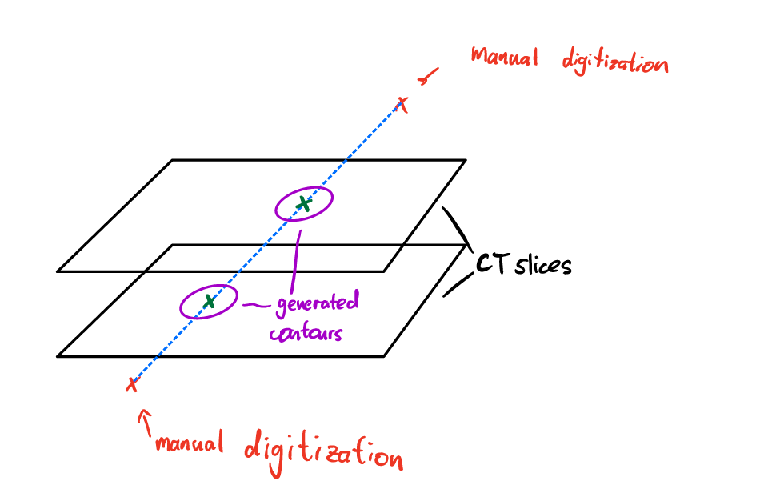

# Milosh Cathter Digitization

When you create the catheter structure it takes the manual series of 3D points and converts them into catheter volumes. The script can be found in the src/Catheter_Ellipse_Path_Finder.py . Here is how it works:

The script takes the catheter points and the slice thicknesses as input. 

It takes 2 points at a time, connects them via a straight line, and finds the intersections of that line with the CT slices. 

Based on the angle of intersection and the diameter of the catheter, the script then creates an elliptical contour of the catheter on that slice. You can imagine this as if you took a cylinder at an angle and took the cross-section.

Finally, we check which pixels/voxels fall into these newly created contours in order to label them as "catheter" for the 3D mask volume.

